# EasyMedRx — System Flowchart

```mermaid
flowchart TD

%% ═══════════════════════════════════════════════════════════
%%  BOOT
%% ═══════════════════════════════════════════════════════════
subgraph BOOT["⚙️ BOOT — main()"]
    A([main]) --> B[Board_init / SPI_init / ADC_init / PWM_init]
    B --> C[sem_init = 0\ng_spiMutex init]
    C --> D[spawn mainThread prio 3]
    C --> E[spawn schedFuncs prio 1]
    D & E --> F[BIOS_start]
end

%% ═══════════════════════════════════════════════════════════
%%  MAIN THREAD — WiFi init
%% ═══════════════════════════════════════════════════════════
subgraph MAIN["📡 mainThread — WiFi Init"]
    M1[open Display handle] --> M2[spawn sl_Task prio 9]
    M2 --> M3[sl_Start]
    M3 --> M4{mode == ROLE_STA?}
    M4 -- No --> M5[sl_WlanSetMode ROLE_STA\nsl_Stop / sl_Start]
    M4 -- Yes --> M6[TAMUConnect\nset hostname + read MAC\nsl_WlanConnect TAMU_IoT]
    M5 --> M6
    M6 --> M7[sem_post &sem\n▶ unblocks schedFuncs]
end

%% ═══════════════════════════════════════════════════════════
%%  NWP EVENTS
%% ═══════════════════════════════════════════════════════════
subgraph NWP["📶 SimpleLink Events — sl_Task"]
    N1([SL_WLAN_EVENT_CONNECT]) --> N2[updateWifiIcon 1]
    N3([SL_NETAPP_IPV4_ACQUIRED]) --> N4[ti_net_SlNet_initConfig]
    N5([SL_WLAN_EVENT_DISCONNECT]) --> N6[updateWifiIcon 0]
    N6 --> N7[reconnectTAMU loop\nmax 3 attempts\nsleep 2s between]
    N7 --> N8{ret == 0?}
    N8 -- Yes --> N9[log accepted]
    N8 -- No --> N10{attempts\nexhausted?}
    N10 -- No --> N7
    N10 -- Yes --> N11[log all failed]
end

%% ═══════════════════════════════════════════════════════════
%%  SCHED FUNCS — orchestrator
%% ═══════════════════════════════════════════════════════════
subgraph SCHED["🎛️ schedFuncs — Boot Orchestrator"]
    S1[sem_wait &sem] --> S2[httpQ_init]
    S2 --> S3[jsonThread inline\nload FS data from server / FS / default\nsystemReady = 1]
    S3 --> S4[TimeKeeper_start]
    S4 --> S5[spawn initLCD_hardware prio 9]
    S5 --> S6[sem_post &sem\n▶ unblocks polling threads]
    S6 --> S7[spawn httpWorkerThread prio 4]
    S6 --> S8[spawn testClearErrorLogs prio 5\none-shot: delete error0-99]
    S6 --> S9[spawn errorFlushThread prio 1]
    S6 --> S10[spawn syncPollingThread prio 2]
end

%% ═══════════════════════════════════════════════════════════
%%  JSON THREAD (inline)
%% ═══════════════════════════════════════════════════════════
subgraph JSON["🗄️ jsonThread — FS Initialisation"]
    J1[loadDummyFiles\ncreate missing FS files] --> J2[POST json1 to server]
    J2 --> J3{response valid?}
    J3 -- Yes --> J4[use server data]
    J3 -- No --> J5{FS file exists?}
    J5 -- Yes --> J6[use FS file]
    J5 -- No --> J7[use firmware default]
    J4 & J6 & J7 --> J8[parse compStock\nkeep csObjHandle / csTmplHandle open]
    J8 --> J9[parse trustedUIDs\ncache uid0-uid7 into g_trustedUIDs\ndestroy handles]
    J9 --> J10[systemReady = 1]
end

%% ═══════════════════════════════════════════════════════════
%%  LCD INIT
%% ═══════════════════════════════════════════════════════════
subgraph LCD_INIT["🖥️ initLCD_hardware"]
    L1[configSPI 4MHz] --> L2[configInterrupt IR GPIO]
    L2 --> L3[initLCD ILI9341 reset + init sequence]
    L3 --> L4[draw header / footer / Scan RFID card]
    L4 --> L5[updateWifiIcon 0]
    L5 --> L6[spawn RC522_senseRFID prio 7]
end

%% ═══════════════════════════════════════════════════════════
%%  RFID SCANNING LOOP
%% ═══════════════════════════════════════════════════════════
subgraph RFID["🔖 RC522_senseRFID — Session State Machine"]
    R1([start]) --> R2{sessionActive == 0?}

    R2 -- Yes\nSCANNING --> R3[lock g_spiMutex\nset SPI 1MHz\nunlock]
    R3 --> R4[RC522_RequestA\nRC522_Anticoll_CL1]
    R4 --> R5{Card\ndetected?}

    R5 -- No --> R16[sleep 50ms]
    R16 --> R17{TimeKeeper\nvalid?}
    R17 -- Yes --> R18[drawClockFooter]
    R17 -- No --> R2
    R18 --> R2

    R5 -- Yes --> R6[format uidStr]
    R6 --> R7[set SPI 4MHz]
    R7 --> R8[uidToFilename uidStr]
    R8 --> R9{Known UID?}

    R9 -- Yes --> R10[activeFile = found\ndraw Card accepted\ndraw Updating...\nsyncProfileFromServer HTTP\nsessionActive = 1]

    R9 -- No --> R11{isTrustedUID?}
    R11 -- Yes --> R12[draw Registering...\nrequestNewProfile HTTP]
    R12 --> R13{Profile\nreceived?}
    R13 -- Yes --> R10A[activeFile = newSlot\nsessionActive = 1]
    R13 -- No --> R14[draw Registration failed\nsleep 2s\ndraw Scan RFID card]
    R14 --> R2

    R11 -- No --> R15[draw Card not recognised\nsleep 3s\ndraw Scan RFID card]
    R15 --> R2

    R10 --> R19
    R10A --> R19

    R2 -- No\nSESSION --> R20[sleep 100ms yield]
    R20 --> R21

    R19([check 0→1 edge]) --> R21{prevActive == 0\nand sessionActive == 1?}
    R21 -- Yes --> R22[spawn bootLCD prio 5]
    R21 -- No --> R23
    R22 --> R23[prevActive = sessionActive]
    R23 --> R24{sessionActive == 0\nand activeFile != NULL?}
    R24 -- Yes\nLOGOUT --> R25[activeFile = NULL\ndraw Scan RFID card]
    R25 --> R2
    R24 -- No --> R2
end

%% ═══════════════════════════════════════════════════════════
%%  SESSION — bootLCD + trackADC
%% ═══════════════════════════════════════════════════════════
subgraph SESSION["👤 Session — bootLCD + trackADC"]
    BL1[bootLCD] --> BL2[redraw chrome\nheader + footer]
    BL2 --> BL3[openActiveProfile\ncreate templateHandle + jsonObjHandle\nparse activeFile\nextract window0-3 into g_sessionWindow]
    BL3 --> BL4[clearMenuArea]
    BL4 --> BL5[refreshDispenseLabels\nbuild stock / dose / Unauthorized labels]
    BL5 --> BL6[drawMenu MENU_MAIN\nupdateWifiIcon]
    BL6 --> BL7[spawn trackADC prio 2]

    BL7 --> TA1[trackADC loop]
    TA1 --> TA2[read ADC]
    TA2 --> TA3{Button\npressed?}
    TA3 -- No change --> TA4{g_clockDirty?}
    TA4 -- Yes --> TA5[drawClockFooter]
    TA4 -- No --> TA6[sleep 50ms]
    TA5 --> TA6
    TA6 --> TA7{sessionActive\n== 0?}
    TA7 -- Yes --> TA8([exit trackADC])
    TA7 -- No --> TA1

    TA3 -- Direction --> TA9[update ADCTracker\nskip Unauthorized rows\nredraw cells]
    TA9 --> TA6

    TA3 -- Select --> TA10[isRowSelectable?]
    TA10 -- No --> TA6
    TA10 -- Yes --> TA11[cursorSelect]
end

%% ═══════════════════════════════════════════════════════════
%%  MENU NAVIGATION
%% ═══════════════════════════════════════════════════════════
subgraph MENU["🗂️ cursorSelect — Menu Logic"]
    CS1{currentMenu} 

    CS1 -- MENU_MAIN --> CS2{row}
    CS2 -- Dispense --> CS3[currentMenu = MENU_DISPENSE\ndrawMenu]
    CS2 -- Account --> CS4[currentMenu = MENU_ACCOUNT\ndrawMenu]
    CS2 -- Notifications --> CS5[currentMenu = MENU_NOTIFICATIONS\ndrawMenu]
    CS2 -- Exit --> CS6[closeActiveProfile\nsessionActive = 0\ndraw Scan RFID card]

    CS1 -- MENU_DISPENSE --> CS7{row}
    CS7 -- 0-3\nif dispenseMask bit set --> CS8[dispense row+1]
    CS7 -- 0-3\nif NOT in mask --> CS9[draw Unauthorized\nsleep 1.5s\nredrawMenu]
    CS7 -- 4 Back --> CS10[currentMenu = MENU_MAIN\ndrawMenu]

    CS1 -- MENU_ACCOUNT --> CS11{row}
    CS11 -- 2 Back --> CS12[currentMenu = MENU_MAIN\ndrawMenu]

    CS1 -- MENU_NOTIFICATIONS --> CS13{row}
    CS13 -- 5 Back --> CS14[currentMenu = MENU_MAIN\ndrawMenu]
end

%% ═══════════════════════════════════════════════════════════
%%  DISPENSE
%% ═══════════════════════════════════════════════════════════
subgraph DISPENSE["💊 dispense — Servo + IR"]
    D1[dispense container] --> D2[getCompartStock]
    D2 --> D3{stock == 0?}
    D3 -- Yes --> D4[decrementCompartStock\nlogError OutOfPills\nreturn -1]

    D3 -- No --> D5[setPWM forward duty\nservo ON]
    D5 --> D6[readIR container]

    D6 --> D7[arm dispenseSem\nset dispenseTracker\nget dose count]
    D7 --> D8[per-pill loop\nsem_timedwait 5s]
    D8 --> D9{IR triggered\nby ISR?}
    D9 -- Yes --> D10[decrementCompartStockByOne\nincrementDispPills\nhttpQ_post webAppUpdate]
    D10 --> D11{all pills\ndispensed?}
    D11 -- No --> D8
    D11 -- Yes --> D12[return 0]

    D9 -- Timeout\nattempt 1 --> D13[unjamServo\n5× reverse-forward cycles]
    D13 --> D14[retry sem_timedwait 5s]
    D14 --> D15{IR triggered?}
    D15 -- Yes --> D10
    D15 -- No\nattempt 2 --> D16[dispenseTracker = 0\nreturn -1]

    D12 --> D17[PWM_stop / close]
    D16 --> D17
    D17 --> D18{readIR\nsuccess?}
    D18 -- No --> D19[logError DispensingError\nhttpQ_post errorN]
    D18 -- Yes --> D20[syncStockWithServer\nhttpQ_postGetResponse compStock\nupdate csObjHandle + FS]
    D19 --> D21([return])
    D20 --> D21
end

%% ═══════════════════════════════════════════════════════════
%%  HTTP QUEUE
%% ═══════════════════════════════════════════════════════════
subgraph HTTPQ["🌐 HTTP Queue — Serialised NWP Access"]
    HQ1([any thread\nhttpQ_post]) --> HQ2[lock g_qMutex\nenqueue HTTP_Q_POST\nunlock\nsem_post g_qSem]
    HQ3([any thread\nhttpQ_postGetResponse]) --> HQ4[lock g_qMutex\nenqueue HTTP_Q_POST_GET\nunlock\nsem_post g_qSem\nsem_wait done ◀ BLOCKS]

    HQ5[httpWorkerThread\nsem_wait g_qSem] --> HQ6{entry type?}
    HQ6 -- POST --> HQ7[httpPost filename\nread type field\nconnect + send\nif updateMCU: overwrite FS\nelse: drain response]
    HQ6 -- POST_GET --> HQ8[httpPostGetResponse filename\nconnect + send\ncopy response to respBuf\nwrite retCode\nsem_post done ▶ unblocks caller]

    HQ7 --> HQ9[g_lastHttpConnectRet = ret\nupdateWifiIcon 0 or 1]
    HQ8 --> HQ9
    HQ9 --> HQ5
end

%% ═══════════════════════════════════════════════════════════
%%  SYNC POLLING THREAD
%% ═══════════════════════════════════════════════════════════
subgraph POLL["🔄 syncPollingThread — 15s Cycle"]
    P1[sem_wait + sem_post\nordering gate] --> P2

    P2[POST compStock\nhttpQ_postGetResponse] --> P3{ret == 0?}
    P3 -- Yes --> P4[log response]
    P3 -- No --> P5{g_lastHttpConnect\n== -111?}
    P5 -- Yes --> P6[log server refused compStock\ncheckAndReconnect\nsl_WlanDisconnect\nsl_WlanConnect TAMU_IoT\nsleep 15s\ncontinue]
    P6 --> P2
    P5 -- No --> P4

    P4 --> P7[POST trustedUIDs\nhttpQ_postGetResponse]
    P7 --> P8{ret == 0?}
    P8 -- Yes --> P9[log response]
    P8 -- No --> P10{g_lastHttpConnect\n== -111?}
    P10 -- Yes --> P11[log server refused trustedUIDs\ncheckAndReconnect\nsleep 15s\ncontinue]
    P11 --> P2
    P10 -- No --> P9

    P9 --> P12[onlineLogin\nPOST onlineLogin file\nextract uid from response]
    P12 --> P13{uid non-empty?}
    P13 -- Yes --> P14[uidToFilename uid]
    P14 --> P15{known UID?}
    P15 -- Yes --> P16[syncProfileFromServer\nactiveFile = found\nsessionActive = 1]
    P15 -- No --> P17[requestNewProfile\nif success: activeFile + sessionActive = 1]
    P16 & P17 --> P18[return 1 session started]
    P13 -- No --> P19[return 0 no login]
    P12 --> P20{ret == -1 and\n-111?}
    P20 -- Yes --> P21[log refused\ncheckAndReconnect\nsleep 15s\ncontinue]
    P21 --> P2
    P20 -- No --> P22[sleep 15s]
    P18 & P19 --> P22
    P22 --> P2
end

%% ═══════════════════════════════════════════════════════════
%%  ERROR FLUSH THREAD
%% ═══════════════════════════════════════════════════════════
subgraph ERR["⚠️ errorFlushThread — 15s Cycle"]
    EF1[sem_wait + sem_post\nordering gate] --> EF2[wait up to 30s\nfor TimeKeeper_isValid]
    EF2 --> EF3[flushErrorBuffer]
    EF3 --> EF4[for each error0-99\nthat exists on FS]
    EF4 --> EF5[httpQ_postGetResponse errorN]
    EF5 --> EF6{return_code\n== 0 in response?}
    EF6 -- Yes --> EF7[sl_FsDel errorN\nacknowledged]
    EF6 -- No --> EF8[retain errorN\nretry next cycle]
    EF7 & EF8 --> EF9{more error\nfiles?}
    EF9 -- Yes --> EF4
    EF9 -- No --> EF10[sleep 15s]
    EF10 --> EF3
end

%% ═══════════════════════════════════════════════════════════
%%  TIMEKEEPING
%% ═══════════════════════════════════════════════════════════
subgraph TIME["🕐 TimeKeeper_thread"]
    T1[syncSNTP\nSNTP_getTime pool.ntp.org\nTimeKeeper_setTime\nrecord g_ntpBase + CLOCK_REALTIME anchor] --> T2{success?}
    T2 -- No --> T3[sleep 15s retry]
    T3 --> T1
    T2 -- Yes --> T4[main loop\nsleep 1s]
    T4 --> T5[TimeKeeper_getLocalTime\nhardware-derived: ntpBase + elapsed - TZ_OFFSET]
    T5 --> T6[format dateBuf / timeBuf]
    T6 --> T7[write g_clockDate / g_clockTime\ng_clockDirty = 1]
    T7 --> T8{sessionActive\n== 1?}
    T8 -- Yes --> T9[drawClockFooter\ndirect LCD draw during session]
    T8 -- No --> T10{3600s elapsed\nhardware time?}
    T9 --> T10
    T10 -- Yes --> T11[syncSNTP re-sync]
    T11 --> T4
    T10 -- No --> T4
end

%% ═══════════════════════════════════════════════════════════
%%  ERROR LOGGING
%% ═══════════════════════════════════════════════════════════
subgraph ERRLOG["📋 logError + parseErrorMessage"]
    EL1([logError called]) --> EL2{error code}
    EL2 -- DispensingError\nOutOfPills\nFatalParsing --> EL3[parseErrorMessage]
    EL2 -- Disconnected --> EL4[UART log only]
    EL3 --> EL5[read UID from activeFile FS\ncreate+destroy local template+object]
    EL5 --> EL6[build error JSON\ntype uid message compartment time]
    EL6 --> EL7[genErrName\nfind free error slot 0-99]
    EL7 --> EL8[storeJsonToFile errorN\nwrite to FS\nhttpQ_post errorN]
end

%% ═══════════════════════════════════════════════════════════
%%  SPI / MUTEX PROTECTION
%% ═══════════════════════════════════════════════════════════
subgraph MUTEX["🔒 SPI Mutex Protection"]
    MX1[g_spiMutex protects ALL SPI access]
    MX1 --> MX2[fillRect: lock → setAddrWindow + all pixels → unlock]
    MX1 --> MX3[drawChar: lock → setAddrWindow + bitmap → unlock]
    MX1 --> MX4[drawNoWifiIcon: lock per row → setAddrWindow + row → unlock]
    MX1 --> MX5[RC522_Read/Write: lock → CS low + transfer + CS high → unlock]
    MX1 --> MX6[setSPIRate: must be called with mutex held]
    MX7[Regions are non-overlapping\nfooter y=222-239\nmenu y=20-221\nheader y=0-19\nNo visual corruption from interleaving]
end

%% ═══════════════════════════════════════════════════════════
%%  CONNECTIONS BETWEEN SUBGRAPHS
%% ═══════════════════════════════════════════════════════════
BOOT --> MAIN
BOOT --> SCHED
MAIN --> NWP
SCHED --> JSON
SCHED --> LCD_INIT
LCD_INIT --> RFID
RFID --> SESSION
SESSION --> MENU
MENU --> DISPENSE
DISPENSE --> HTTPQ
SCHED --> HTTPQ
POLL --> HTTPQ
ERR --> HTTPQ
ERRLOG --> HTTPQ
SCHED --> POLL
SCHED --> ERR
SCHED --> TIME
TIME --> SESSION
```

---

## Global State Summary

| Variable | Set By | Read By | Meaning |
|---|---|---|---|
| `sem` | mainThread posts | schedFuncs / errorFlushThread / syncPollingThread wait | Boot ordering gate |
| `sessionActive` | RC522_senseRFID / onlineLogin (=1), cursorSelect (=0) | trackADC, TimeKeeper_thread, RC522_senseRFID | 1 = session live |
| `activeFile` | RC522_senseRFID / onlineLogin | dispense, logError, syncProfileFromServer | Logged-in user FS slot |
| `systemReady` | jsonThread (=1) | storeJsonToFile | Gate: no HTTP before boot done |
| `g_lastHttpConnectRet` | httpConnect (http_comm.c) | syncPollingThread, checkAndReconnect | Last TCP connect result; -111 = refused |
| `csObjHandle / csTmplHandle` | jsonThread (permanent) | getCompartStock, syncStockWithServer | Live compStock JSON |
| `jsonObjHandle / templateHandle` | openActiveProfile / closeActiveProfile | getProfileDose, getScriptName | Session user profile JSON |
| `g_trustedUIDs[8]` | jsonThread | isTrustedUID | Cached authorized card UIDs |
| `g_clockDirty` | TimeKeeper_thread | trackADC | Signal: redraw clock footer |
| `dispenseSem` | IRQHandler ISR posts | readIR waits (5s timeout) | IR pill detection signal |
| `g_spiMutex` | main init | All LCD + RC522 primitives | SPI bus serialization |
| `wifiConnected` | updateWifiIcon | drawMenu, clearNoWifiIcon | Last HTTP POST success state |
